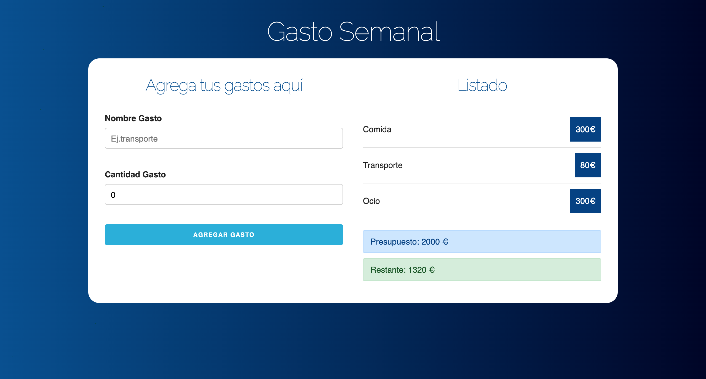

# Expenses-tracker

### Deploy link: [expenses-tracker](https://expenses-tracker-react.netlify.app)


The aim of this project was to work with useState and the PropTypes library to see if the props we are passing through components are correct.

## Functional Description

User will have the chance to: generate their budget, add expenses and check inmediately
how they affect to the budget (user can see warnings when the budget % it is low)

## Technical Description

Developed with: React and CSS with Skeleton.

## Follow the next steps

Have installed node (+npm)

Start the react site by using the following command:
````
npm run start 
````

-------------
This project was bootstrapped with [Create React App](https://github.com/facebook/create-react-app).
